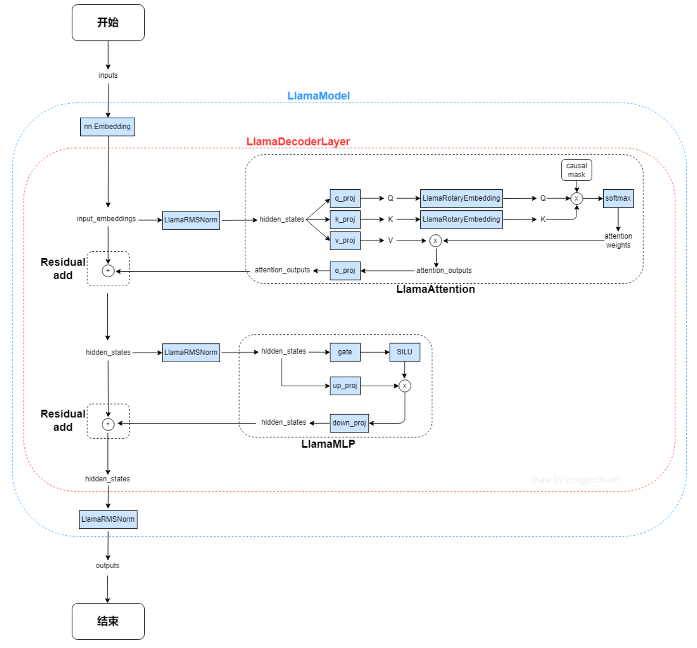

## 整体流程
1. 实例化 LLM，也即实例化 `LLMEngine`
    1. 调用 `ModelRunner`
        1. 建立 NCCL 通信组
        2. 使用 `load_model` 加载模型（详见“加载模型”）
        3. `warmup_model`
            1. `torch.cuda.empty_cache()` 清理显存
            2. 用最大 sequens 跑一个 batch `ModelRunner.run`
                1. `prepare_prefill` 把一个 batch 里的所有 seq 拼接到一起
                2. 获取 `temperatures`
                3. `run_model` 获取下一个 token 的 logits
                4. `sampler` 根据 logits 得到下一个 token 的 id
                5. `reset_context()` 重置 context
                6. 返回新生成的 token_ids
            2. `torch.cuda.empty_cache()` 清理显存
        4. `allocate_kv_cache`
            1. 计算显存的总量、使用量、空闲量、峰值等信息
            2. 根据统计信息，计算 `config.num_kvcache_blocks` kv-cahe blocks 数量
            3. 分配一个 kv_cahe 存储表
    2. 获取 `tokenizer`
    3. 实例化调度器 `Scheduler`
        1. 实例化 `BlockManager`
            1. 创建全局 `blocks`
            2. `hash_to_block_id` 通过 hash 获取 block_id
            3. `free_block_ids` 空闲的 blocks 队列
            4. `used_block_ids` 被占用的 blocks 集合
        2. 初始化空的 `waiting` 等待队列
        3. 初始化空的 `running` 执行队列
    4. 注册退出机制
2. 实例化 SamplingParams 采样参数
3. 应用 chat_template: `tokenizer.apply_chat_template`
4. 生成 `llm.generate(prompts, sampling_params)`
    1. `add_request`
        1. 把 prompt 转换成 token_ids
        2. 根据 prompt 实例化 `Sequence`
        3. 把 sequence 加到 scheduler 中的 waiting 列表
    2. 循环执行（直到 `self.scheduler.is_finished()`）
        1. `LLMEngine.step()`
            1. `self.scheduler.schedule()` 
                1. prefill 阶段（`waiting` 队列有 seq 且序列数量小于 `max_num_seqs`：
                    1. 从 `waiting` 队列里按顺序取出 seq
                    2. `allocate` 只在 prefill 阶段执行，分配 kv-cache blocks
                        1. `seq.num_blocks` 通过当前 seq 的长度计算需要使用的 blocks 数量
                        2. 遍历需要的 blocks 数量
                            1. 根据当前 seq 的 block 索引切片 token_ids
                            2. 计算这部分 token_ids 的 hash 值
                            3. 从全局 hash 表 `hash_to_block_id` 中获取匹配的全局 block_id
                                - 如果没命中缓存：分配一个新的 block，`free_block_ids` 移除该 block_id，`used_block_ids` 添加该 block_id
                                - 如果命中缓存：更新 seq 的总缓存数 `num_cached_tokens` 并从全局 block 拿到这个 block，`block.ref_count` + 1
                            4. 如果当前 token_ids 占满了一个 block 大小： 
                                1. 计算 hash 值并更新当前 block 的 hash 索引
                                2. 更新 `hash_to_block_id` 索引
                            5. 当前 seq 的 block_table 追加 block_id
                    3. 更新当前 seq 状态为 `RUNNING`
                    4. `waiting` 队列弹出该 seq，`running` 队列加入该 seq
                    5. 当前 seq 添加到要执行的 `scheduled_seqs` 里，返回 `scheduled_seqs` 和 `is_prefill = True`
                2. decode 阶段（`waiting` 队列空了或序列数量大于等于 `max_num_seqs`）：
                    1. 从 `running` 队列里按顺序取出 seq
                    2. `can_append` 只在 decode 阶段执行，当最后一个 block 只有 1 个 token 时，如果 `free_block_ids` 还有空闲的 block，则返回 True
                        - 如果不能分配 block：如果 `running` 队列有 seqs，循环弹出 seq 序列，并调用 `preempt`；如果 `running` 队列没有 seqs，对当前的 seq 调用 `preempt` 并退出
                            1. 更新 seq 状态为 `WAITING`
                            2. `block_manager.deallocate` 卸载该 seq 对应的所有 block
                                1. 倒序取出该 seq 的所有 block
                                    1. 每个 block 的 ref_count - 1
                                    2. 如果一个 block 没有任何引用，则 `_deallocate_block` 更新 block 状态
                                        1. `used_block_ids` 移除该 block
                                        2. `free_block_ids` 加入该 block
                                2. seq 的 `num_cached_tokens` 归零
                                3. seq 的 `block_table` 索引列表清空
                        - 如果能分配 block：
                            1. `may_append` 只在 decode 阶段执行
                                1. 取出 seq 的最后一个 block
                                2. 最后一个 block 里只有 1 个 token 时：
                                    1. 从 `free_block_ids` 取一个新的 block
                                    2. `_allocate_block`
                                        1. 从全局 block 里取出新 block，因为是 decode 阶段的新 block，因此该 block 的引用必然是 0
                                        2. `block.reset()` 引用为 1，hash 为 -1
                                        3. `free_block_ids` 移除该 block
                                        4. `used_block_ids` 加入该 block
                                    3. seq 的 `block_table` 加入新开辟的 block_id
                                2. 如果最后一个 block 正好满了：
                                    1. 上一个 block 还没处理，hash 必然是 -1
                                    2. 取出上一个 block 的 token_ids
                                    3. 如果当前 seq 对应的 block_table > 1，也即有多个 block，那么就需要取出上上个 block 的 hash 作为前缀 `prefix`
                                    4. 基于 token_ids 和 prefix 计算 hash
                                    5. 更新上一个 block 的 hash 信息
                                    6. 更新 `hash_to_block_id` 索引
                            2. 待执行列表 `scheduled_seqs` 里依次追加从 `running` 里弹出的 seq
                            3. `running` 里再加入 `scheduled_seqs` 里的 seq，因为 `running` 一直有 seqs，因此后面每一步的 `scheduler.schedule()` 都直接进入 decode 阶段
                            4. 返回 `scheduled_seqs` 和 `is_prefill = False`
            2. `ModelRunner.run`
                1. `prepare_prefill` 把 `scheduled_seqs` 里待执行的所有 seqs 压平，放入一个 `input_ids` 里，包括 `positions`
                2. `prepare_sample` 获取 `temperatures`
                3. `run_model` 获取下一个 token 的 logits
                4. `sampler` 根据 logits 得到下一个 token 的 id
                5. `reset_context()` 重置 context
                6. 返回新生成的 token_ids (shape: (bs,))
            3. `scheduler.postprocess` 后处理
                1. 把新生成的这个 token_id 添加到 seq 中
                2. 判断是否遇到 stop words 或达到最大生成长度，如果是
                    1. 更新 seq 状态为 `FINISHED`
                    2. `block_manager.deallocate` 卸载该 seq 对应的所有 block
                        1. 倒序取出该 seq 的所有 block
                        2. 每个 block 的 ref_count - 1
                        3. 如果一个 block 没有任何引用，则 `_deallocate_block` 更新 block 状态
                            1. `used_block_ids` 移除该 block
                            2. `free_block_ids` 加入该 block
                    3. `running` 队列移除该 seq
            4. 如果 `seq.is_finished` 生成完毕，则获取输出
            5. 计算当前阶段的 tokens 数量
        2. 如果生成结束，按照 seq_id 顺序组合输出
        3. 解码 token_ids 为 text 并返回这个 batch 的所有结果
        4. 最后应该再加一个去掉 stop words 的操作

## 加载模型
1. 首先获取模型的模块名称映射
2. 遍历读取 *.safetensors
3. 遍历每个 key (也即权重名称)，如果有映射，就把名称替换成映射后的名称
4. 根据权重名称获取模型定义里该模块的权重加载方式
    1. 默认方式就是直接把保存的权重拷贝到模块里对应的权重上
    2. 自定义了 `weight_loader` 方法的模块，使用自定义的加载方式（比如张量并行的加载方式）

## 张量并行
weight_loader: 如何将从模型文件（checkpoint）中读出的、属于单个逻辑层（比如 Query 层）的完整权重，正确地加载到当前 GPU 所持有的、合并后的大权重矩阵的对应“切片”上
1. param.data 的形状是合并后（比如QKV的合并矩阵或up、down的合并矩阵）的 tp 切片后的大小
2. 计算出 param.data 当前层的偏移量，以便正确读取出 Q, K, V 或 up, down
3. 从保存的完整的当前层参数里，取出 tp 切分后对应的部分参数
4. 正确地把参数赋值

## Sequence

主要属性：
- status: 当前序列的状态 WAITING | RUNNING | FINISHED
- block_table: 当前序列使用的全局 blocks 的索引，方便从全局 blocks 里取数
- num_cached_tokens: 当前缓存了的 tokens 数量

## Block

主要属性：
- ref_count: 当前 block 被引用的数量
- hash: hash 值

## BlockManager

主要属性：
- block_size: 每个 block 存储的 tokens 数量
- blocks: 全局 blocks 表
- hash_to_block_id：通过 hash 值快速检索 block
- free_block_ids: 当前空闲的 blocks 队列
- used_block_ids: 被占用了的 blocks 集合

## LLaMA 结构

注意：Decoder Layer 只有第一个 for 循环的第一个 LayerNorm 输入只有 hidden_states，没有 residual，其他时候 LayerNorm 都是接收 hidden_states 和 residual 两个输入。

## RoPE
原始：

$$ \mathbf{R}^d_{\Theta, m} \mathbf{x} = 
\begin{pmatrix}
x_1 \\
x_2 \\
x_3 \\
x_4 \\
\vdots \\
x_{d-1} \\
x_d
\end{pmatrix}
\otimes
\begin{pmatrix}
\cos m\theta_1 \\
\cos m\theta_1 \\
\cos m\theta_2 \\
\cos m\theta_2 \\
\vdots \\
\cos m\theta_{d/2} \\
\cos m\theta_{d/2}
\end{pmatrix}
+
\begin{pmatrix}
-x_2 \\
x_1 \\
-x_4 \\
x_3 \\
\vdots \\
-x_d \\
x_{d-1}
\end{pmatrix}
\otimes
\begin{pmatrix}
\sin m\theta_1 \\
\sin m\theta_1 \\
\sin m\theta_2 \\
\sin m\theta_2 \\
\vdots \\
\sin m\theta_{d/2} \\
\sin m\theta_{d/2}
\end{pmatrix}
$$

实践中通常将正旋转部分（cos项）和负旋转部分（sin项）分别批量处理，然后再拼接回原始顺序：

$$\mathbf{R}^d_{\Theta, m} \mathbf{x} =
\left[
\begin{pmatrix}
x_1 \\
x_3 \\
\vdots \\
x_{d-1}
\end{pmatrix}
\odot
\begin{pmatrix}
\cos m\theta_1 \\
\cos m\theta_2 \\
\vdots \\
\cos m\theta_{d/2}
\end{pmatrix}
\right]
-
\left[
\begin{pmatrix}
x_2 \\
x_4 \\
\vdots \\
x_d
\end{pmatrix}
\odot
\begin{pmatrix}
\sin m\theta_1 \\
\sin m\theta_2 \\
\vdots \\
\sin m\theta_{d/2}
\end{pmatrix}
\right]
\;\;\bigoplus\;\;
\left[
\begin{pmatrix}
x_2 \\
x_4 \\
\vdots \\
x_d
\end{pmatrix}
\odot
\begin{pmatrix}
\cos m\theta_1 \\
\cos m\theta_2 \\
\vdots \\
\cos m\theta_{d/2}
\end{pmatrix}
\right]
+
\left[
\begin{pmatrix}
x_1 \\
x_3 \\
\vdots \\
x_{d-1}
\end{pmatrix}
\odot
\begin{pmatrix}
\sin m\theta_1 \\
\sin m\theta_2 \\
\vdots \\
\sin m\theta_{d/2}
\end{pmatrix}
\right]
$$